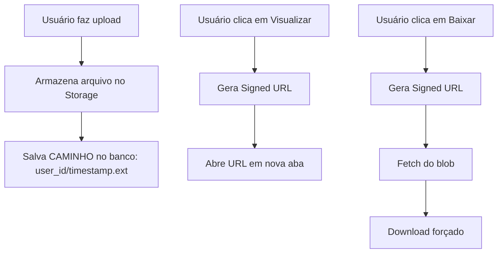

# Correção de Download e Visualização de Notas Fiscais

## Análise do Problema

### Causa Raiz
O bucket `notas-fiscais` foi configurado como **privado** (`public: false`), mas o código em [`lancamentos.tsx`](src/components/dashboard/lancamentos.tsx:61) usa `getPublicUrl()` para gerar URLs. 

**Problema**: URLs públicas de buckets privados retornam erro JSON de autenticação em vez do arquivo.

### Fluxo Atual (Problemático)

```typescript
// lancamentos.tsx - linha 61-65
const { data: { publicUrl } } = supabase.storage
  .from('notas-fiscais')
  .getPublicUrl(fileName)  // ❌ Não funciona para bucket privado

fileUrl = publicUrl  // URL não funciona sem autenticação
```

```typescript
// notas-fiscais.tsx - linha 156
window.open(transaction.file_url!, '_blank')  // ❌ Abre JSON de erro
```

---

## Solução

Para buckets privados, use **Signed URLs** (URLs assinadas temporárias) que funcionam mesmo com RLS habilitado.

### Opção 1: Usar Signed URLs (Recomendado)

As signed URLs são URLs temporárias que expiram após um período definido, permitindo acesso seguro a arquivos em buckets privados.

### Opção 2: Tornar o Bucket Público

Alternativamente, você pode tornar o bucket público, mas isso **não é recomendado** por questões de segurança, pois qualquer pessoa poderia acessar os arquivos.

---

## Mudanças Necessárias

### 1. Modificar `lancamentos.tsx` - Armazenar caminho do arquivo

O problema é que `getPublicUrl()` retorna apenas a URL base, sem token de autenticação. Para buckets privados, precisamos:

1. Armazenar o **caminho do arquivo** (não a URL pública) no banco de dados
2. Gerar **signed URLs** sob demanda quando necessário

**Mudança no upload:**

```typescript
// ANTES (linha 61-65)
const { data: { publicUrl } } = supabase.storage
  .from('notas-fiscais')
  .getPublicUrl(fileName)
fileUrl = publicUrl

// DEPOIS
fileUrl = fileName  // Armazenar apenas o caminho: "user_id/timestamp.ext"
```

### 2. Modificar `notas-fiscais.tsx` - Gerar Signed URLs

Adicionar função para gerar URLs assinadas sob demanda:

```typescript
const getSignedUrl = async (filePath: string): Promise<string | null> => {
  if (!supabase) return null
  
  const { data, error } = await supabase.storage
    .from('notas-fiscais')
    .createSignedUrl(filePath, 3600) // 1 hora de expiração
  
  if (error) {
    console.error('Erro ao gerar URL:', error)
    return null
  }
  
  return data.signedUrl
}

const handleView = async (filePath: string) => {
  const url = await getSignedUrl(filePath)
  if (url) {
    window.open(url, '_blank')
  }
}

const handleDownload = async (filePath: string, filename: string) => {
  const url = await getSignedUrl(filePath)
  if (url) {
    const response = await fetch(url)
    const blob = await response.blob()
    const blobUrl = URL.createObjectURL(blob)
    const link = document.createElement('a')
    link.href = blobUrl
    link.download = filename
    link.click()
    URL.revokeObjectURL(blobUrl)
  }
}
```

### 3. Atualizar interface Transaction

O tipo `Transaction` em [`types/database.ts`](src/types/database.ts) pode precisar de ajuste se `file_url` for usado para armazenar o caminho em vez de URL.

---

## Diagrama de Fluxo Corrigido



---

## Arquivos a Modificar

| Arquivo | Mudança |
|---------|---------|
| [`src/components/dashboard/lancamentos.tsx`](src/components/dashboard/lancamentos.tsx) | Armazenar caminho em vez de URL pública |
| [`src/components/dashboard/notas-fiscais.tsx`](src/components/dashboard/notas-fiscais.tsx) | Adicionar funções de signed URL e atualizar handlers |

---

## Considerações Importantes

### Migração de Dados Existente

Se já existirem arquivos no banco com URLs públicas, você precisará:

1. Identificar quais registros têm URLs completas vs caminhos
2. Extrair o caminho da URL completa ou
3. Tratar ambos os casos no código

**Exemplo de extração de caminho:**
```typescript
const extractPath = (url: string): string => {
  // URL: https://xxx.supabase.co/storage/v1/object/public/notas-fiscais/user_id/file.pdf
  // Path: user_id/file.pdf
  const parts = url.split('/notas-fiscais/')
  return parts.length > 1 ? parts[1] : url
}
```

### Tempo de Expiração

O tempo de expiração da signed URL deve ser suficiente para:
- Visualização: 60 segundos é suficiente
- Download: Depende do tamanho do arquivo, 1 hora é seguro

---

## Próximos Passos

1. Aplicar as mudanças em `lancamentos.tsx`
2. Aplicar as mudanças em `notas-fiscais.tsx`
3. Testar upload, visualização e download
4. Verificar se há dados existentes que precisam de migração
