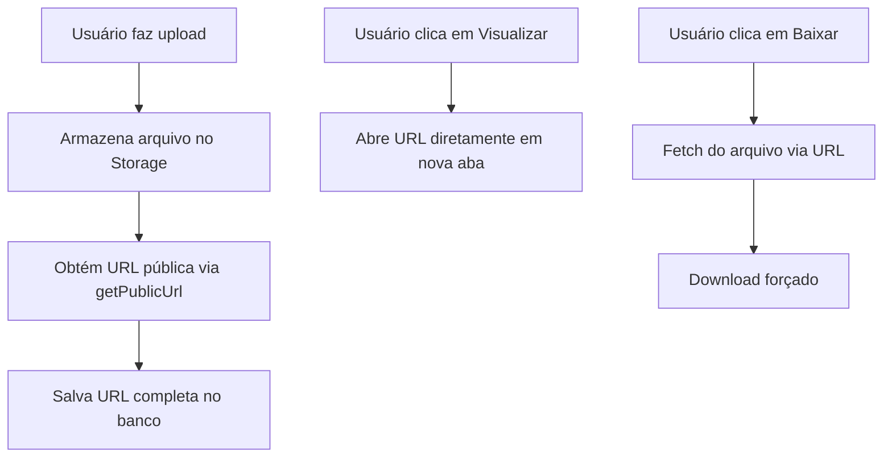

# Configuração para Bucket Público

## Contexto

O bucket `notas-fiscais` foi recriado como **público**. O código atual foi projetado para buckets privados usando signed URLs. Precisamos ajustar o sistema para usar URLs públicas.

## Mudanças Necessárias

### 1. Modificar `lancamentos.tsx` - Armazenar URL Pública

**Arquivo:** [`src/components/dashboard/lancamentos.tsx`](src/components/dashboard/lancamentos.tsx)

**Linha 61-63 (atual):**
```typescript
// Store the file path (not public URL) since bucket is private
// Signed URLs will be generated on demand when viewing/downloading
fileUrl = fileName
```

**Alterar para:**
```typescript
// Get the public URL for the uploaded file
const { data: { publicUrl } } = supabase.storage
  .from('notas-fiscais')
  .getPublicUrl(fileName)

fileUrl = publicUrl
```

### 2. Modificar `notas-fiscais.tsx` - Usar URL Diretamente

**Arquivo:** [`src/components/dashboard/notas-fiscais.tsx`](src/components/dashboard/notas-fiscais.tsx)

**Simplificar as funções de visualização e download:**

Remover a função `getSignedUrl` e a lógica de extração de caminho. Usar a URL diretamente.

**Função `handleView` (linhas 93-129):**
```typescript
const handleView = (filePath: string) => {
  window.open(filePath, '_blank')
}
```

**Função `handleDownload` (linhas 131-185):**
```typescript
const handleDownload = async (filePath: string, filename: string) => {
  try {
    const response = await fetch(filePath)
    if (!response.ok) {
      throw new Error('Falha ao baixar o arquivo.')
    }
    
    const blob = await response.blob()
    const blobUrl = URL.createObjectURL(blob)
    
    const link = document.createElement('a')
    link.href = blobUrl
    link.download = filename
    document.body.appendChild(link)
    link.click()
    document.body.removeChild(link)
    
    URL.revokeObjectURL(blobUrl)
  } catch (error) {
    toast({
      title: 'Erro ao baixar',
      description: error instanceof Error ? error.message : 'Erro desconhecido',
      variant: 'destructive',
    })
  }
}
```

## Diagrama de Fluxo



## Arquivos a Modificar

| Arquivo | Mudança |
|---------|---------|
| [`src/components/dashboard/lancamentos.tsx`](src/components/dashboard/lancamentos.tsx) | Usar `getPublicUrl()` e armazenar URL completa |
| [`src/components/dashboard/notas-fiscais.tsx`](src/components/dashboard/notas-fiscais.tsx) | Remover lógica de signed URLs, usar URL diretamente |

## Próximos Passos

1. Aplicar mudanças em `lancamentos.tsx`
2. Aplicar mudanças em `notas-fiscais.tsx`
3. Testar upload, visualização e download
