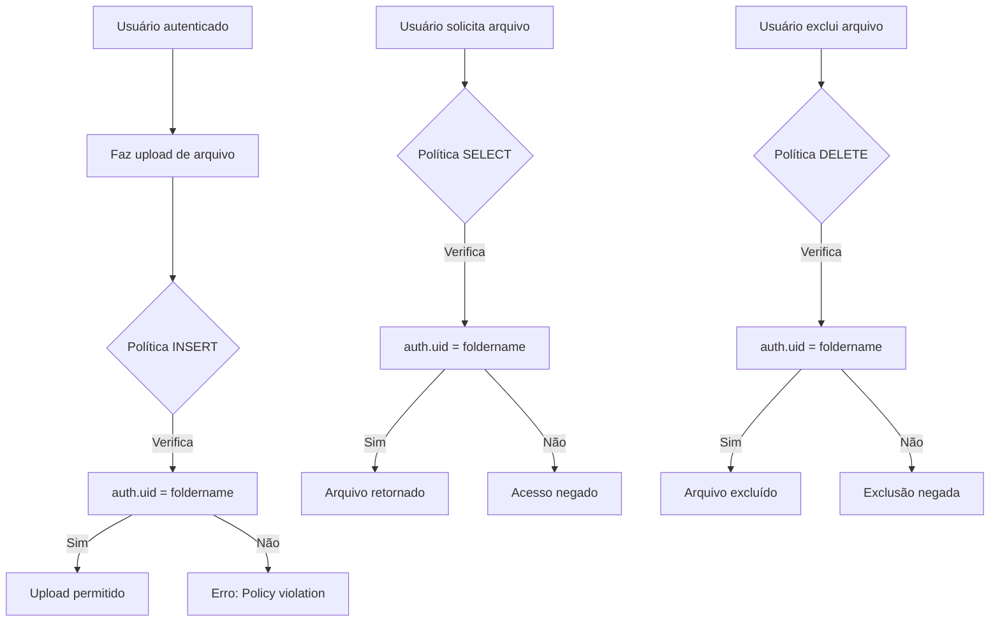

# Correção de Política de Segurança do Storage Bucket - Supabase

## Análise do Problema

O erro de violação de política de segurança ocorre porque:

1. **Políticas de Storage não aplicadas**: No arquivo [`schema.sql`](supabase/schema.sql:130), as políticas de Storage estão comentadas (linhas 136-148)
2. **Bucket não configurado**: O bucket `notas-fiscais` pode não existir ou não ter as políticas RLS corretas
3. **Estrutura de caminho**: O upload é feito no formato `{user_id}/{timestamp}.{ext}` (ver [`lancamentos.tsx`](src/components/dashboard/lancamentos.tsx:51))

---

## Solução Completa

### Passo 1: Criar o Bucket (se não existir)

Acesse o **Supabase Dashboard** → **Storage** → clique em **"New bucket"**:
- Nome: `notas-fiscais`
- **Desmarque** a opção "Public bucket" (bucket deve ser privado)
- Clique em "Create bucket"

### Passo 2: Executar o SQL no SQL Editor

Acesse **Supabase Dashboard** → **SQL Editor** e execute o seguinte código SQL:

```sql
-- ============================================
-- STORAGE BUCKET POLICIES PARA NOTAS FISCAIS
-- FinMEI - Controle Financeiro
-- ============================================

-- 1. Criar o bucket se não existir (executar uma vez)
INSERT INTO storage.buckets (id, name, public)
VALUES ('notas-fiscais', 'notas-fiscais', false)
ON CONFLICT (id) DO NOTHING;

-- 2. Remover políticas existentes (para evitar conflitos)
DROP POLICY IF EXISTS "Users can upload own files" ON storage.objects;
DROP POLICY IF EXISTS "Users can view own files" ON storage.objects;
DROP POLICY IF EXISTS "Users can delete own files" ON storage.objects;
DROP POLICY IF EXISTS "Users can update own files" ON storage.objects;

-- 3. Criar política de UPLOAD (INSERT)
-- Permite que usuários autenticados façam upload apenas para sua própria pasta
CREATE POLICY "Users can upload own files"
ON storage.objects
FOR INSERT
TO authenticated
WITH CHECK (
    bucket_id = 'notas-fiscais' 
    AND auth.uid()::text = (storage.foldername(name))[1]
);

-- 4. Criar política de VISUALIZAÇÃO (SELECT)
-- Permite que usuários autenticados visualizem apenas seus próprios arquivos
CREATE POLICY "Users can view own files"
ON storage.objects
FOR SELECT
TO authenticated
USING (
    bucket_id = 'notas-fiscais' 
    AND auth.uid()::text = (storage.foldername(name))[1]
);

-- 5. Criar política de EXCLUSÃO (DELETE)
-- Permite que usuários autenticados excluam apenas seus próprios arquivos
CREATE POLICY "Users can delete own files"
ON storage.objects
FOR DELETE
TO authenticated
USING (
    bucket_id = 'notas-fiscais' 
    AND auth.uid()::text = (storage.foldername(name))[1]
);

-- 6. Criar política de ATUALIZAÇÃO (UPDATE)
-- Permite que usuários autenticados atualizem apenas seus próprios arquivos
CREATE POLICY "Users can update own files"
ON storage.objects
FOR UPDATE
TO authenticated
USING (
    bucket_id = 'notas-fiscais' 
    AND auth.uid()::text = (storage.foldername(name))[1]
);
```

> **Nota**: O comando `ALTER TABLE storage.objects ENABLE ROW LEVEL SECURITY` foi removido pois o RLS já vem habilitado por padrão no Storage do Supabase, e você não tem permissão para alterar essa configuração.

---

## Explicação das Políticas

### Como funciona a verificação de propriedade

A função `storage.foldername(name)` retorna um array com os nomes das pasturas no caminho do arquivo.

**Exemplo de caminho de arquivo:**
```
a1b2c3d4-e5f6-7890-abcd-ef1234567890/1708123456789.pdf
└─────────────────────────────────────┘ └────────────────┘
           [1] - user_id                    [2] - arquivo
```

A expressão `(storage.foldername(name))[1]` extrai o primeiro elemento (user_id), que é comparado com `auth.uid()::text`.

### Estrutura das Políticas

| Política | Operação | Condição |
|----------|----------|----------|
| Users can upload own files | INSERT | `WITH CHECK` - valida no momento do upload |
| Users can view own files | SELECT | `USING` - filtra arquivos visíveis |
| Users can delete own files | DELETE | `USING` - valida antes de excluir |
| Users can update own files | UPDATE | `USING` - valida antes de atualizar |

---

## Verificação e Testes

### Verificar se o bucket foi criado

```sql
SELECT * FROM storage.buckets WHERE name = 'notas-fiscais';
```

### Verificar políticas ativas

```sql
SELECT 
    policyname,
    cmd,
    roles,
    CASE 
        WHEN cmd = 'INSERT' THEN with_check::text
        ELSE qual::text
    END as condition
FROM pg_policies 
WHERE tablename = 'objects' 
AND schemaname = 'storage'
AND policyname LIKE '%notas-fiscais%';
```

### Testar upload via código

Após aplicar as políticas, o código em [`lancamentos.tsx`](src/components/dashboard/lancamentos.tsx:49) deve funcionar corretamente:

```typescript
const fileName = `${user.id}/${Date.now()}.${fileExt}`

const { error: uploadError } = await supabase.storage
    .from('notas-fiscais')
    .upload(fileName, file)
```

---

## Troubleshooting

### Erro: "new row violates row-level security policy"

**Causa**: O usuário não está autenticado ou o caminho do arquivo não corresponde ao user_id.

**Solução**: Verifique se:
1. O usuário está autenticado (`user` não é null)
2. O caminho do arquivo começa com o ID do usuário

### Erro: "permission denied for table objects"

**Causa**: RLS não está habilitado corretamente no storage.objects.

**Solução**: Execute:
```sql
ALTER TABLE storage.objects ENABLE ROW LEVEL SECURITY;
```

### Erro: "bucket not found"

**Causa**: O bucket `notas-fiscais` não foi criado.

**Solução**: Execute o comando INSERT no bucket ou crie manualmente no Dashboard.

---

## Diagrama de Fluxo



---

## Próximos Passos

1. Execute o SQL no Supabase SQL Editor
2. Verifique se as políticas foram criadas com sucesso
3. Teste o upload de um arquivo no sistema
4. Verifique os logs do Supabase caso haja erros

---

## Referências

- [Supabase Storage Policies](https://supabase.com/docs/guides/storage/security/access-control)
- [Row Level Security](https://supabase.com/docs/guides/auth/row-level-security)
- [Storage API](https://supabase.com/docs/reference/javascript/storage-from-upload)
